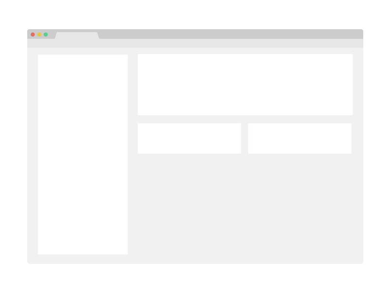

<!--
README.md
-->

<!-- Anchor for linking to the top of the file -->
<a name="readme-top"></a>

<!-- Introduction Block -->

<!-- Project Logo/Icon -->
<div align="center">
  

  <!-- Header -->
  <h1>My CookieCutter Coding Project Repo Template</h1>

  <!-- Brief Description / Tagline -->
  <p>
    This is my attempt at creating a CookieCutter Template for GitHub Coding Projects. <br> 
    See the acknowledgements for links to the resources I used to create this template.
  </p>

<!-- Badges/Shields -->
<p>

  <!-- Contributors -->
  <a href="https://github.com/sj-codedemo/template-project-repository/graphs/contributors">
    
  </a>

  <!-- Last Commit -->
  <a href="">
    
  </a>

  <!-- Forks -->
  <a href="https://github.com/sj-codedemo/template-project-repository/network/members">
    
  </a>

  <!-- Stars -->
  <a href="https://github.com/sj-codedemo/template-project-repository/stargazers">
    
  </a>

  <!-- Open Issues -->
  <a href="https://github.com/sj-codedemo/template-project-repository/issues/">
    
  </a>

  <!-- License -->
  <a href="https://github.com/sj-codedemo/template-project-repository/blob/master/LICENSE">
    
  </a>

</p>

<!-- Quick Links -->
<h4>
    <a href="https://github.com/sj-codedemo/template-project-repository/">View Demo</a>
  <span> · </span>
    <a href="https://github.com/sj-codedemo/template-project-repository">Documentation</a>
  <span> · </span>
    <a href="https://github.com/sj-codedemo/template-project-repository/issues/">Report Bug</a>
  <span> · </span>
    <a href="https://github.com/sj-codedemo/template-project-repository/issues/">Request Feature</a>
  </h4>
</div>

<br />

<!-- Table of Contents -->
# Table of Contents

* [About the Project](#about-the-project)
    * [Features](#features)
    * [Built With](#built-with)
* [Getting Started](#getting-started)
    * [Prerequisites](#prerequisites)
    * [Usage](#usage)
* [Roadmap](#roadmap)
* [Contributing](#contributing)
* [Code of Conduct](#code-of-conduct)
* [FAQ](#faq)
* [License](#license)
* [Contact](#contact)
* [Acknowledgements](#acknowledgements)

<!-- About the Project -->
## About the Project



TODO: Write a paragraph here informing the user what the project is and why they should be interested in it. Include a screenshot from the project above this paragraph.

<p align="right">(<a href="#readme-top">back to top</a>)</p>

<!-- Features -->
### Features

- Feature 1
- Feature 2
- Feature 3

<p align="right">(<a href="#readme-top">back to top</a>)</p>

## Built With
<!-- Note: Leave 2 blank spaces after list items/sub-items to ensure correct spacing between rendered list items -->

* [](https://github.github.com/gfm/)
  * The specification for the Markdown syntax used in GitHub repositories.


* [](https://cookiecutter.readthedocs.io/en/latest/)
  * Command-line utility for creating projects from project templates (cookiecutters).


* [](https://github.com/features/actions)
  * Automation tool for continuous integration and continuous deployment pipelines.


<!-- Getting Started -->
## Getting Started


<!-- Prerequisites -->
### Prerequisites

**Python**

Visit [https://www.python.org/downloads/](https://www.python.org/downloads/) for installation instructions.


**Cookiecutter**

  ```bash
  pip install -U cookiecutter
  ```


For other installation options and detailed instructions,
refer to the [Cookiecutter Installation Guide](https://cookiecutter.readthedocs.io/en/latest/installation.html).


<!-- Usage -->
### Usage

**To create a new project from this template:**

1. Run the following command to generate a new project from the template:

   ```bash
   cookiecutter gh:sj-codedemo/template-project-repository
   ```
   
   This command will clone the template from GitHub and prompt you to fill in various project details.


2. Follow the interactive prompts to customise your project's configuration.
   - TODO: Add a gif of the interactive prompt steps
   - TODO: Add a code block with the prompts and options


<p align="right">(<a href="#readme-top">back to top</a>)</p>


<!-- Roadmap -->
## Roadmap

- [x] Milestone 1
    - [x] Objective 1
    - [x] Objective 2
    - [x] Objective 3
- [ ] TODO: Milestone 2
    - [ ] TODO: Objective 1
    - [ ] TODO: Objective 2
    - [ ] TODO: Objective 3
- [ ] ...
    - [ ] ...
    - [ ] ...
    - [ ] ...

<p align="right">(<a href="#readme-top">back to top</a>)</p>

<!-- Contributing -->
## Contributing

<a href="https://github.com/sj-codedemo/template-project-repository/graphs/contributors">
  
</a>

Contributions are always welcome!

See CONTRIBUTING.md for ways to get started.

<p align="right">(<a href="#readme-top">back to top</a>)</p>

<!-- Code of Conduct -->
### Code of Conduct

Please read the [Code of Conduct](https://github.com/sj-codedemo/template-project-repository/blob/master/CODE_OF_CONDUCT.md)

<p align="right">(<a href="#readme-top">back to top</a>)</p>

<!-- FAQ -->
## FAQ

- Question 1

    - Answer 1

- Question 2

    - Answer 2

- Question 3

    - Answer 3

<p align="right">(<a href="#readme-top">back to top</a>)</p>

<!-- License -->
## License

This project is licensed under the MIT licence. Feel free to edit and distribute this template as you like.

See [LICENCE](LICENCE.txt) for more information.

<p align="right">(<a href="#readme-top">back to top</a>)</p>

<!-- Contact -->
## Contact

sj-codedemo - [141835690+sj-codedemo@users.noreply.github.com](mailto:141835690+sj-codedemo@users.noreply.github.com)

Project Link: [https://github.com/sj-codedemo/template-project-repository](https://github.com/sj-codedemo/template-project-repository)

<p align="right">(<a href="#readme-top">back to top</a>)</p>

<!-- Acknowledgments -->
## Acknowledgements

- [Shields.io](https://shields.io/)
- [Awesome README](https://github.com/matiassingers/awesome-readme)
- [awesome-readme-template](https://github.com/Louis3797/awesome-readme-template)
- [Readme Template](https://github.com/othneildrew/Best-README-Template)
- [Keep a Changelog](https://keepachangelog.com/en/1.1.0/)
- [Simple Icons](https://simpleicons.org/)
- [Commitlint](https://commitlint.io/)
- [axolo-co/developer-resources](https://github.com/axolo-co/developer-resources/tree/main/pull-request-templates)
- [Conventional Commits Specification](https://www.conventionalcommits.org/en/v1.0.0/#specification)


<p align="right">(<a href="#readme-top">back to top</a>)</p>
