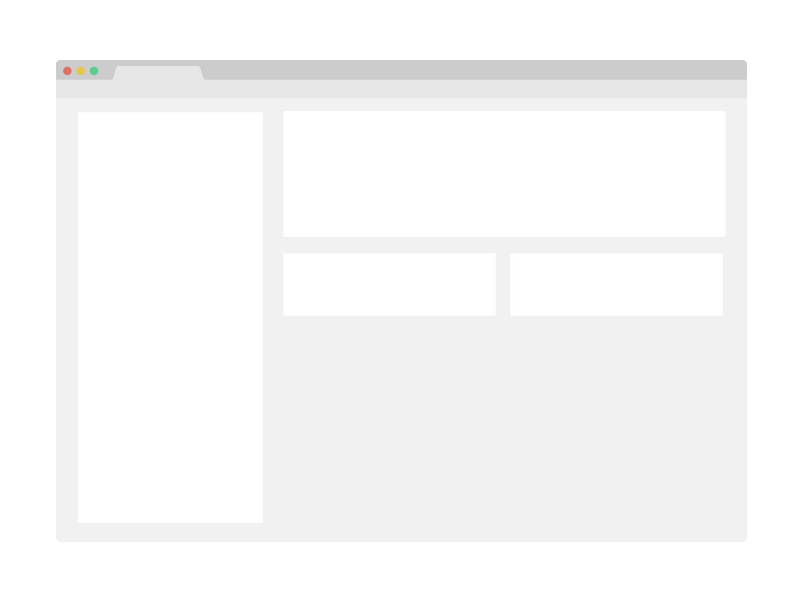

<!--
README.md
-->

<!-- Anchor for the top of the file -->
<a name="readme-top"></a>

<!-- Project Logo/Icon -->
<div align="center">

  
  <h1>Template README.md</h1>

  <p>
    Template README.md file for new projects.
  </p>
  
<!-- Badges/Shields -->
<p>
  <a href="https://github.com/{{cookiecutter.github_username}}/{{cookiecutter.project_slug}}/graphs/contributors">
    
  </a>
  <a href="">
    
  </a>
  <a href="https://github.com/{{cookiecutter.github_username}}/{{cookiecutter.project_slug}}/network/members">
    
  </a>
  <a href="https://github.com/{{cookiecutter.github_username}}/{{cookiecutter.project_slug}}/stargazers"></a>
    
  </a>
  <a href="https://github.com/{{cookiecutter.github_username}}/{{cookiecutter.project_slug}}/issues/">
    
  </a>
  <a href="https://github.com/{{cookiecutter.github_username}}/{{cookiecutter.project_slug}}/blob/master/LICENSE">
    
  </a>
</p>

<h4>
    <a href="https://github.com/{{cookiecutter.github_username}}/{{cookiecutter.project_slug}}/">View Demo</a>
  <span> · </span>
    <a href="https://github.com/{{cookiecutter.github_username}}/{{cookiecutter.project_slug}}">Documentation</a>
  <span> · </span>
    <a href="https://github.com/{{cookiecutter.github_username}}/{{cookiecutter.project_slug}}/issues/">Report Bug</a>
  <span> · </span>
    <a href="https://github.com/{{cookiecutter.github_username}}/{{cookiecutter.project_slug}}/issues/">Request Feature</a>
  </h4>
</div>

<br />

<!-- Table of Contents -->
# Table of Contents

1. [Table of Contents](#table-of-contents)
   1. [About the Project](#about-the-project)
      1. [Features](#features)
      2. [Build With](#build-with)
   2. [Getting Started](#getting-started)
      1. [Prerequisites](#prerequisites)
      2. [Installation](#installation)
      3. [Running](#running)
   3. [Roadmap](#roadmap)
   4. [Contributing](#contributing)
      1. [Code of Conduct](#code-of-conduct)
   5. [FAQ](#faq)
   6. [License](#license)
   7. [Contact](#contact)
   8. [Acknowledgements](#acknowledgements)
  
<!-- About the Project -->
## About the Project



TODO: Write a paragraph here informing the user what the project is and why they should be interested in it. Include a screenshot from the project above this paragraph.

<p align="right">(<a href="#readme-top">back to top</a>)</p>

<!-- Features -->
### Features

- Feature 1
- Feature 2
- Feature 3

<p align="right">(<a href="#readme-top">back to top</a>)</p>

<!-- TechStack -->
### Build With

<div style="width: 100%;">
  <table style="width: 100%; border-collapse: collapse;">
    <tr>
      <td style="width: 50%; border: none;">
        <h4>Front End</h4>
        <ul>
          <li>Tech 1</li>
          <li>Tech 2</li>
          <li>Tech 3</li>
        </ul>
      </td>
      <td style="width: 50%; border: none;">
        <h4>Backend</h4>
        <ul>
          <li>Tech 1</li>
          <li>Tech 2</li>
          <li>Tech 3</li>
        </ul>
      </td>
    </tr>
    <tr>
      <td style="width: 50%; border: none;">
        <h4>Other</h4>
        <ul>
          <li>Tech 1</li>
          <li>Tech 2</li>
          <li>Tech 3</li>
        </ul>
      </td>
      <td style="width: 50%; border: none;">
        <h4>Other</h4>
        <ul>
          <li>Tech 1</li>
          <li>Tech 2</li>
          <li>Tech 3</li>
        </ul>
      </td>
    </tr>
  </table>
</div>

<p align="right">(<a href="#readme-top">back to top</a>)</p>

<!-- Getting Started -->
## Getting Started

This is an example of how you may give instructions on setting up your project locally. To get a local copy up and running follow these simple example steps.

<!-- Prerequisites -->
### Prerequisites

- Prerequisite 1

  ```bash
  TODO: Write the install prerequisites script
  ```

- Prerequisite 2

  ```bash
  TODO: Write the install prerequisites script
  ```

<!-- Installation -->
### Installation

_Provide instructions to users for how to install and set up the app._

1. Clone the repo

   ```bash
   git clone https://github.com/{{cookiecutter.github_username}}/{{cookiecutter.project_slug}}
   ```

2. Install packages

   ```bash
   TODO: Write the install dependencies script
   ```

<!-- Running -->
### Running

_Provide instructions to users for how to run the app._

1. Clone the repo

   ```bash
   git clone https://github.com/{{cookiecutter.github_username}}/{{cookiecutter.project_slug}}
   ```

2. Go to the project directory

   ```bash
   cd {{cookiecutter.project_slug}}
   ```

3. Run the project

   ```bash
   TODO: Write the run script
   ```

<p align="right">(<a href="#readme-top">back to top</a>)</p>

<!-- Roadmap -->
## Roadmap

- [x] Milestone 1
  - [x] Objective 1
  - [x] Objective 2
  - [x] Objective 3
- [ ] TODO: Milestone 2
  - [ ] TODO: Objective 1
  - [ ] TODO: Objective 2
  - [ ] TODO: Objective 3
- [ ] ...
  - [ ] ...
  - [ ] ...
  - [ ] ...

<p align="right">(<a href="#readme-top">back to top</a>)</p>

<!-- Contributing -->
## Contributing

<a href="https://github.com/{{cookiecutter.github_username}}/{{cookiecutter.project_slug}}/graphs/contributors">
  
</a>

Contributions are always welcome!

See CONTRIBUTING.md for ways to get started.

<p align="right">(<a href="#readme-top">back to top</a>)</p>

<!-- Code of Conduct -->
### Code of Conduct

Please read the [Code of Conduct](https://github.com/{{cookiecutter.github_username}}/{{cookiecutter.project_slug}}/blob/master/CODE_OF_CONDUCT.md)

<p align="right">(<a href="#readme-top">back to top</a>)</p>

<!-- FAQ -->
## FAQ

- Question 1

  - Answer 1

- Question 2

  - Answer 2

- Question 3

  - Answer 3

<p align="right">(<a href="#readme-top">back to top</a>)</p>

<!-- License -->
## License

Distributed under the MIT License. See [LICENCE](LICENCE.txt) for more information.

<p align="right">(<a href="#readme-top">back to top</a>)</p>

<!-- Contact -->
## Contact

{{cookiecutter.github_username}} - [{{cookiecutter.email}}](mailto:{{cookiecutter.email}})

Project Link: [https://github.com/{{cookiecutter.github_username}}/{{cookiecutter.project_slug}}](https://github.com/{{cookiecutter.github_username}}/{{cookiecutter.project_slug}})

<p align="right">(<a href="#readme-top">back to top</a>)</p>

<!-- Acknowledgments -->
## Acknowledgements

Many thanks to the following resources for helping me create this template:

- **README and Documentation**

    - [Awesome README - https://github.com/matiassingers/awesome-readme](https://github.com/matiassingers/awesome-readme)
    - [awesome-readme-template - https://github.com/Louis3797/awesome-readme-template](https://github.com/Louis3797/awesome-readme-template)
    - [Readme Template - https://github.com/othneildrew/Best-README-Template](https://github.com/othneildrew/Best-README-Template)
    - [axolo-co/developer-resources - https://github.com/axolo-co/developer-resources/tree/main/pull-request-templates](https://github.com/axolo-co/developer-resources/tree/main/pull-request-templates)
    - [Keep a Changelog - https://keepachangelog.com/en/1.1.0/](https://keepachangelog.com/en/1.1.0/)
- **Documentation Tools**

    - [Just the Docs - https://pmarsceill.github.io/just-the-docs/](https://pmarsceill.github.io/just-the-docs/)
    - [GitHub Pages - https://pages.github.com/](https://pages.github.com/)
    - [Shields.io - https://shields.io/](https://shields.io/)
    - [Simple Icons - https://simpleicons.org/](https://simpleicons.org/)
- **Best Git Practices**

    - [Commitlint - https://commitlint.io/](https://commitlint.io/)
    - [Conventional Commits Specification - https://www.conventionalcommits.org/en/v1.0.0/#specification](https://www.conventionalcommits.org/en/v1.0.0/#specification)
    - [Semantic Versioning - https://semver.org/](https://semver.org/)


<p align="right">(<a href="#readme-top">back to top</a>)</p>
